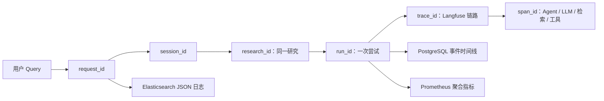

# 深度研究可观测性运行手册

## 入口

| 数据 | 页面 | 用途 |
|---|---|---|
| 研究时间线 | 应用右侧“诊断”页签 | 面向一次会话查看运行、阶段和错误 |
| JSON 日志 | http://127.0.0.1:5601/app/discover | 按 `request_id`、`session_id`、`research_id`、`run_id`、`trace_id` 查日志 |
| 指标看板 | http://127.0.0.1:3002 | 错误率、P95、Token、检索、工具、队列和基础设施 |
| Prometheus | http://127.0.0.1:9095 | 查询原始指标和告警规则 |
| Alertmanager | http://127.0.0.1:9096 | 查看当前触发及已恢复的告警 |
| Langfuse | http://127.0.0.1:3000 | 展开 Agent、LLM Generation、检索和工具 Span |
| Elasticsearch | http://127.0.0.1:1200 | 日志索引与只读排查 API |

Grafana 本地初始账号来自 `observability/.env`。仓库内 `.env.example` 只有占位值，真实文件被 Git 忽略。

## 启停

在仓库根目录执行：

```powershell
# Filebeat 直接写 Elasticsearch（默认，资源占用更低）
.\observability\manage.ps1 start direct

# 或启用 Filebeat -> Logstash -> Elasticsearch；不要同时启用两条日志管道
.\observability\manage.ps1 start logstash

.\observability\manage.ps1 status
.\observability\manage.ps1 stop
```

应用需在 `backend` 目录启动，`backend/.env` 中的 `JSON_LOG_FILE=logs/application.jsonl` 会让 Filebeat 获得 JSON 日志。Prometheus 从 Docker Desktop 的 `host.docker.internal:8000/metrics` 抓取后端指标。

## 一次研究如何串起来



- 刷新和重新打开会话：前端用 `session_id` 读取 checkpoint 和诊断时间线。
- 大纲暂停与审批后续跑：共用 `research_id`，分别产生新的 `run_id`。
- 找到错误事件后：复制 `trace_id` 去 Langfuse；复制 `request_id` 或 `run_id` 去 Kibana。
- 日志、Trace 或监控服务故障：研究继续执行，PostgreSQL 事件写入也采用失败降级。

## 事故排查顺序

1. 在应用“诊断”页确认哪个 `run_id` 失败、失败阶段和 `trace_id`。
2. 在 Langfuse 按 Trace 展开，确认是 LLM、Retriever、Agent 还是 Python Tool。
3. 在 Kibana Discover 用 `run_id : "..."` 查询同一次尝试的结构化日志；需要 HTTP 上下文时用 `request_id`。
4. 在 Grafana 查看同一时间窗的错误率、P95、Token 和基础设施 Target 状态。
5. 如果事件时间线也为空，直接检查 PostgreSQL 和应用 JSON 文件，区分“业务未执行”与“观测链路故障”。

## 直接查看各存储

### PostgreSQL

```powershell
docker exec industry_postgres psql -U postgres -d industry_assistant -c "SELECT id, research_id, session_id, status, current_phase, duration_ms, input_tokens, output_tokens, started_at FROM research_runs ORDER BY started_at DESC LIMIT 20;"
docker exec industry_postgres psql -U postgres -d industry_assistant -c "SELECT run_id, sequence, event_type, phase, status, duration_ms, created_at FROM research_events ORDER BY created_at DESC LIMIT 100;"
```

事件 `payload` 已做内容最小化：Prompt、Query、正文、报告和文档仅保存长度/数量与 SHA-256，不保存原文。

### Elasticsearch / Kibana

```powershell
Invoke-RestMethod http://127.0.0.1:1200/_cat/indices/industry-research-logs-*?v
Invoke-RestMethod http://127.0.0.1:1200/_ilm/policy/industry-research-logs-30d
```

日志索引保留 30 天。Kibana 启动时自动创建 `industry-research-logs-*` Data View。

### Redis

```powershell
docker exec industry_redis redis-cli INFO keyspace
docker exec industry_redis redis-cli --scan --pattern "research:*"
```

使用 `SCAN`，不要在生产数据量较大时执行阻塞式 `KEYS *`。

### Milvus

```powershell
Set-Location backend
.\.venv\Scripts\python.exe -c "from pymilvus import connections, utility; connections.connect(host='127.0.0.1', port='19530'); print(utility.list_collections())"
```

Milvus 只应保存知识库向量与元数据；研究事件、日志和 Trace 不写入 Milvus。

### Langfuse

1. 打开 http://127.0.0.1:3000 ，进入项目 Settings -> API Keys。
2. 把项目的 Public Key、Secret Key 只写入本地 `backend/.env`：

```dotenv
LANGFUSE_PUBLIC_KEY=pk-lf-...
LANGFUSE_SECRET_KEY=sk-lf-...
```

3. 重启后端。响应头 `X-Trace-ID`、研究事件的 `trace_id` 和 Langfuse Trace ID 应一致。

密钥不能从 Langfuse PostgreSQL 反向恢复；数据库只保存哈希。这是当前唯一需要在 UI 中完成的密钥操作。

## 告警通知

默认 Alertmanager receiver 只在本地页面保留告警，不向外发送，避免测试环境误发消息。复制 `observability/alertmanager/notification.example.yml` 中需要的 Email 或企业微信 Webhook receiver 到本地 `alertmanager.yml`，填入真实凭据后重启 Alertmanager。真实 SMTP 密码和 Webhook 不能提交到 Git。

预置告警包括：API Target Down、5xx 超 5%、HTTP P95 超 30 秒、LLM P95 超 60 秒、工具失败率超 20%、研究失败、队列积压、PostgreSQL/Redis exporter down。

## 配置验证

```powershell
.\observability\manage.ps1 config direct
docker exec industry_prometheus promtool check config /etc/prometheus/prometheus.yml
docker exec industry_prometheus promtool check rules /etc/prometheus/rules/research-alerts.yml
docker exec industry_alertmanager amtool check-config /etc/alertmanager/alertmanager.yml
docker exec industry_filebeat filebeat test config -c /usr/share/filebeat/filebeat.yml --strict.perms=false
docker exec industry_filebeat filebeat test output -c /usr/share/filebeat/filebeat.yml --strict.perms=false
```

实现所遵循的官方参考：

- [Prometheus 下载与版本](https://prometheus.io/download/)
- [Alertmanager 文档](https://prometheus.io/docs/alerting/latest/alertmanager/)
- [Grafana Docker 文档](https://grafana.com/docs/grafana/latest/setup-grafana/installation/docker/)
- [Filebeat Docker 文档](https://www.elastic.co/docs/reference/beats/filebeat/running-on-docker)
- [Langfuse OpenTelemetry](https://langfuse.com/integrations/native/opentelemetry)
